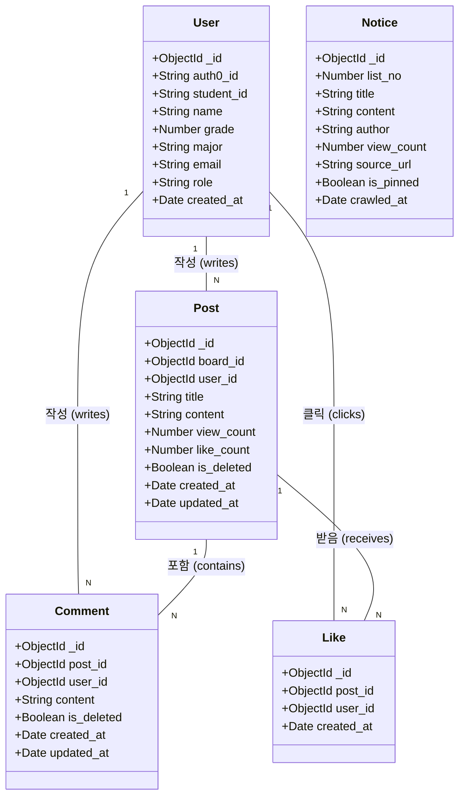
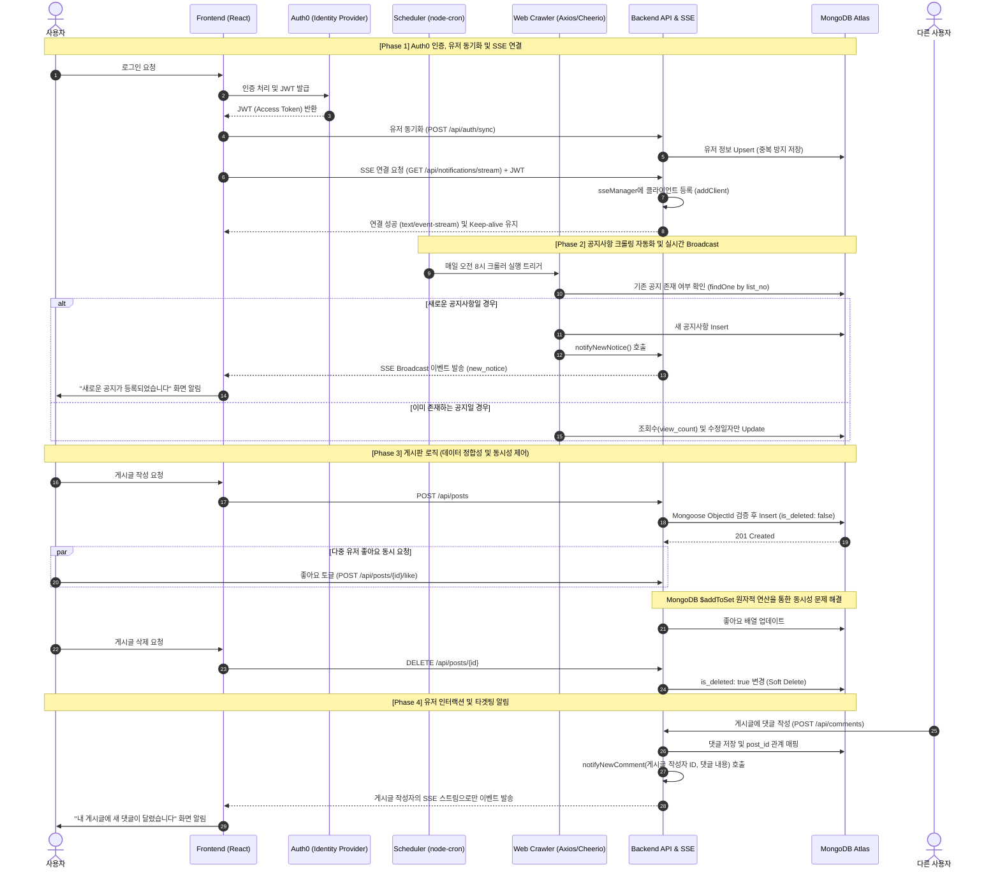

# 실시간 학과 공지 및 소통 플랫폼 프로젝트 수행 보고서

**프로젝트명:** 캠퍼스 보드 (Campus Board) 
**과제 분류:** 과제 1 — 실시간 학과 공지 및 소통 플랫폼  

---

## 1. 실험의 목적과 범위

### 1.1 목적

본 프로젝트는 학과 홈페이지에 분산된 공지사항을 자동으로 수집하고, 학생들이 한 곳에서 공지를 확인하는 동시에 자유롭게 의견을 나눌 수 있는 모바일 최적화 웹 서비스를 개발하는 것을 목적으로 한다. 특히 학과 공지사항 크롤링 자동화, JWT 기반 인증, SSE(Server-Sent Events)를 활용한 실시간 알림 기능을 핵심 기술 목표로 설정하였다.

### 1.2 포함 범위

- 학과 공지사항 자동 크롤링 및 목록 제공 (동국대 컴퓨터공학과 기준)
- Auth0 기반 사용자 인증(회원가입 / 로그인 / 로그아웃)
- 학년별·전공별 게시판 운영 (CRUD)
- 게시글 댓글 및 좋아요 기능
- SSE 방식의 실시간 알림 (새 공지사항, 댓글 알림)
- 마이페이지 (내 게시글, 좋아요 게시글, 작성 댓글 조회)
- 모바일 최적화 반응형 UI

### 1.3 미포함 범위

- 파일 첨부 기능 (UI 연동 미완성)
- 관리자 전용 기능 (role: admin 스키마 정의는 완료, 별도 관리 페이지는 미구현)
- 이메일 인증 또는 학번 실인증 연동
- 배포 환경 구축 (로컬 개발 환경 기준)

---

## 2. 분석 — 기능 목록

### 2.1 유스케이스 다이어그램


### 2.2 Actor 정의

**학생(Student):** 시스템의 주요 사용자. 공지사항을 확인하고 커뮤니티 활동(게시글 작성, 댓글, 좋아요)을 수행한다.

**대학 홈페이지(University Website):** 공지사항 데이터의 원천 소스. 시스템이 주기적으로 HTML을 Fetch하여 데이터를 수집하는 대상이다.

### 2.3 유스케이스 명세서

#### 1) 회원 관리 및 인증

| 기능 | 설명 | 사전 조건 | 비고 |
|------|------|-----------|------|
| 회원가입 | 학생 Actor가 이메일/소셜 계정으로 Auth0를 통해 계정을 생성한다. | 없음 | Auth0 Universal Login 사용 |
| 로그인 | 가입된 정보로 Auth0 JWT를 발급받고 서버에 사용자 정보를 Upsert 동기화한다. | 계정 존재 | POST /api/auth/sync 호출 필요 |
| 로그아웃 | Auth0 세션과 클라이언트 토큰을 삭제하여 세션을 종료한다. | 로그인 상태 | — |

#### 2) 공지사항 서비스

| 기능 | 설명 | 사전 조건 | 비고 |
|------|------|-----------|------|
| 공지사항 크롤링 | Scheduler가 매일 오전 8시, 서버 시작 시 1회 대학 홈페이지를 자동으로 파싱한다. | 서버 실행 | node-cron + Axios + Cheerio |
| 새 공지 알림 | 신규 공지 저장 시 SSE Broadcast로 접속 중인 모든 사용자에게 알림을 전송한다. | SSE 연결 상태 | notifyNewNotice() 호출 |
| 공지사항 확인 | 수집된 공지 목록 및 상세 내용을 열람한다. | 로그인 필요 | — |

#### 3) 커뮤니티 기능

| 기능 | 설명 | 사전 조건 | 비고 |
|------|------|-----------|------|
| 게시글 작성 | 전공 게시판, 학년 게시판에 제목/내용을 입력하여 새 글을 작성한다. | 로그인 필요 | board_id로 게시판 구분 |
| 게시글 수정 | 작성자 본인이 게시글 내용을 수정한다. | 로그인 + 작성자 | — |
| 게시글 삭제 | 작성자 본인이 게시글을 삭제한다. (Soft Delete 적용) | 로그인 + 작성자 | is_deleted: true |
| 댓글 작성 | 게시글에 댓글을 작성하고, 게시글 작성자에게 알림을 전송한다. | 로그인 필요 | 본인 글 댓글 시 알림 미전송 |
| 좋아요 토글 | 게시글에 좋아요를 누르거나 취소한다. | 로그인 필요 | 동시성 제어 적용 |
| 게시글 열람 | 다른 사용자의 게시글을 조회한다. | 없음 | — |

#### 4) 마이페이지 기능

| 기능 | 설명 | 사전 조건 | 비고 |
|------|------|-----------|------|
| 마이페이지 조회 | 본인이 작성한 글 목록, 좋아요한 글 목록, 작성 댓글 목록을 확인한다. | 로그인 필요 | — |

### 2.4 와이어프레임


---

## 3. 설계

### 3.1 데이터베이스 설계 (클래스 다이어그램)

MongoDB를 사용하며 Mongoose ODM으로 스키마를 정의한다. 컬렉션 간의 연관 관계는 `ObjectId`를 활용한 참조(Reference) 방식으로 설계하였으며, 게시글 및 댓글 컬렉션에는 데이터 복구 가능성을 고려하여 물리적 삭제 대신 Soft Delete 방식을 적용하였다.



#### 컬렉션 스키마 상세

**User**

| 필드명 | 타입 | 설명 | 필수여부 |
|--------|------|------|----------|
| _id | ObjectId | MongoDB 기본 고유 식별자 | 자동 |
| auth0_id | String | Auth0 고유 식별자 (sub) | 필수 |
| student_id | String | 학번 | 필수 |
| name | String | 이름 | 필수 |
| grade | Number | 학년 | 필수 |
| major | String | 전공 | 필수 |
| email | String | 이메일 | 필수 |
| role | String | 권한 (user / admin) | 기본값: user |
| created_at | Date | 생성일 (자동) | 자동 |

**Post**

| 필드명 | 타입 | 설명 | 필수여부 |
|--------|------|------|----------|
| _id | ObjectId | MongoDB 기본 고유 식별자 | 자동 |
| board_id | ObjectId | 소속 게시판 (Board 참조) | 필수 |
| user_id | ObjectId | 작성자 (User 참조) | 필수 |
| title | String | 게시글 제목 | 필수 |
| content | String | 게시글 내용 | 필수 |
| view_count | Number | 조회수 | 기본값: 0 |
| like_count | Number | 좋아요 수 | 기본값: 0 |
| is_deleted | Boolean | 삭제 여부 (Soft Delete) | 기본값: false |
| created_at | Date | 생성일 | 자동 |
| updated_at | Date | 수정일 | 자동 |

**Notice**

| 필드명 | 타입 | 설명 | 필수여부 |
|--------|------|------|----------|
| _id | ObjectId | MongoDB 기본 고유 식별자 | 자동 |
| list_no | Number | 공지 고유 번호 (크롤링 기준 키) | 필수 |
| title | String | 공지 제목 | 필수 |
| content | String | 공지 본문 | 선택 |
| author | String | 작성자 | 필수 |
| view_count | Number | 조회수 | 기본값: 0 |
| source_url | String | 원본 공지 URL | 필수 |
| is_pinned | Boolean | 공지 고정 여부 | 기본값: false |
| crawled_at | Date | 크롤링 시각 | 필수 |

**Comment**

| 필드명 | 타입 | 설명 | 필수여부 |
|--------|------|------|----------|
| _id | ObjectId | MongoDB 기본 고유 식별자 | 자동 |
| post_id | ObjectId | 소속 게시글 (Post 참조) | 필수 |
| user_id | ObjectId | 작성자 (User 참조) | 필수 |
| content | String | 댓글 내용 | 필수 |
| is_deleted | Boolean | 삭제 여부 (Soft Delete) | 기본값: false |
| created_at | Date | 생성일 | 자동 |
| updated_at | Date | 수정일 | 자동 |

**Like** — (post_id + user_id) 복합 unique 인덱스 적용으로 중복 좋아요 방지

| 필드명 | 타입 | 설명 | 필수여부 |
|--------|------|------|----------|
| _id | ObjectId | MongoDB 기본 고유 식별자 | 자동 |
| post_id | ObjectId | 좋아요한 게시글 (Post 참조) | 필수 |
| user_id | ObjectId | 좋아요한 유저 (User 참조) | 필수 |
| created_at | Date | 생성일 | 자동 |

---

### 3.2 백엔드 API 설계

Auth0를 활용한 JWT 기반 인증 체계를 구축하고, 커스텀 미들웨어(`authMiddleware`)를 통해 보호 엔드포인트를 제어하였다.

**주요 API 엔드포인트 명세**

| 기능 분류 | 메서드 | 경로 | 인증 | 설명 |
|-----------|--------|------|------|------|
| 유저 동기화 | POST | `/api/auth/sync` | 필요 | Auth0 토큰 정보와 클라이언트 데이터를 DB에 Upsert |
| 게시글 목록 | GET | `/api/posts` | 불필요 | 전체 게시글 목록 조회 (is_deleted: false 필터링) |
| 게시글 작성 | POST | `/api/posts` | 필요 | 신규 글 작성 |
| 게시글 수정 | PATCH | `/api/posts/:id` | 필요 | 작성자 본인만 수정 가능 |
| 게시글 삭제 | DELETE | `/api/posts/:id` | 필요 | Soft Delete (is_deleted: true) |
| 좋아요 토글 | POST | `/api/posts/:id/like` | 필요 | 좋아요 추가/취소 (동시성 제어 적용) |
| 내 게시글 | GET | `/api/posts/my` | 필요 | 본인이 작성한 게시글 목록 |
| 내 댓글 | GET | `/api/posts/my-comments` | 필요 | 본인이 작성한 댓글 목록 |
| 좋아요 게시글 | GET | `/api/posts/liked` | 필요 | 본인이 좋아요한 게시글 목록 |
| 공지 목록 | GET | `/api/notices` | 불필요 | 크롤링된 공지사항 목록 조회 |
| 실시간 알림 | GET | `/api/notifications/stream` | 필요 | SSE 방식 실시간 알림 스트림 연결 |

---

### 3.3 통합 순서 다이어그램 (Sequence Diagram)

본 다이어그램은 프로젝트의 전체 라이프사이클을 나타낸다. 클라이언트의 로그인 및 인증(Auth0)부터 서버의 실시간 알림 연결(SSE), 게시판의 핵심 비즈니스 로직(CRUD 및 동시성 제어), 그리고 백그라운드에서 동작하는 스케줄러 기반의 공지사항 크롤링까지 모든 시스템의 상호작용을 통합하여 시각화하였다.



---

### 3.4 SSE 실시간 알림 시스템 설계

SSE(Server-Sent Events) 방식을 사용하여 서버에서 클라이언트로 단방향 실시간 알림을 전송한다. WebSocket과 달리 별도 프로토콜 업그레이드 없이 HTTP 연결을 그대로 유지하며, 알림처럼 서버→클라이언트 단방향 통신만 필요한 경우에 적합하다.

**sseManager 모듈 구조** — 연결된 클라이언트를 `Map<userId, res>` 형태로 관리하며, 클라이언트 등록/제거 및 이벤트 전송 기능을 분리하여 댓글 API와 크롤러에서 호출 가능하도록 구성하였다.

| 이벤트명 | 발생 조건 | 전송 대상 | 전송 데이터 |
|----------|-----------|-----------|-------------|
| connected | SSE 연결 성공 시 | 해당 유저 | `{ message }` |
| new_comment | 내 게시글에 댓글 작성 시 | 게시글 작성자 1명 | `{ commentId, postId, content }` |
| new_notice | 새 공지사항 등록 시 | 접속 중인 전체 유저 | `{ noticeId, title, source }` |

---

### 3.5 핵심 알고리즘 — 슈도코드

#### 유저 동기화 (Upsert 전략)

```text
함수 handleUserSync(req, res):
  토큰 = req.headers.authorization
  만약 인증실패(토큰, Audience 누락 검증):
    반환 403 Forbidden
  
  유저정보 = DB.User.findOneAndUpdate(
    { auth0_id: 토큰.sub },
    { $set: req.body },
    { upsert: true, new: true }
  )
  반환 201 Created
```

#### 좋아요 처리 (동시성 제어)

```text
함수 handleToggleLike(req, res):
  // MongoDB $addToSet을 활용한 원자적 연산
  업데이트결과 = DB.Post.updateOne(
    { _id: 게시글ID },
    { $addToSet: { liked_users: 요청유저ID } }
  )

  만약 업데이트결과.수정됨 == 0:
    // 이미 좋아요를 누른 상태라면 배열에서 제거 ($pull)
    DB.Post.updateOne({ _id: 게시글ID }, { $pull: { liked_users: 요청유저ID } })
  
  반환 200 OK
```

#### 댓글 알림 흐름

```text
함수 handleCommentCreate(req, res):
  토큰 = req.headers.authorization
  만약 인증실패(토큰):
    반환 401 Unauthorized

  댓글 = { post_id, user_id, content }
  DB에 댓글 저장(댓글)

  게시글 = DB에서 게시글 조회(post_id)
  만약 게시글.user_id != 댓글.user_id:
    // 본인 글에 본인이 댓글 달 때는 알림 미전송
    notifyNewComment(게시글.user_id, 댓글)
```

#### 공지사항 크롤링 흐름

```text
함수 crawlAndNotify():
  공지목록 = 학교사이트크롤링(CRAWL_TARGETS)

  반복 공지 in 공지목록:
    만약 DB에 공지 존재(공지.list_no):
      DB 업데이트(view_count, updated_at)
    아니면:
      DB에 공지 저장(공지)
      notifyNewNotice(공지)  // 전체 사용자 Broadcast

함수 notifyNewNotice(공지):
  반복 (userId, res) in clients:
    이벤트 전송(res, "new_notice", 공지)
```

---

## 4. 구현

### 4.1 구현 환경

| 항목 | 내용 |
|------|------|
| 개발 언어 (백엔드) | JavaScript (Node.js 24.x) |
| 프레임워크 (백엔드) | Express.js 4.18 |
| 데이터베이스 | MongoDB Atlas |
| ODM | Mongoose 8.23 |
| 인증 | Auth0 (express-oauth2-jwt-bearer 1.8) |
| 크롤링 라이브러리 | Axios 1.6 + Cheerio 1.0 |
| 스케줄링 | node-cron 3.0 |
| 개발 도구 (백엔드) | VS Code, Postman, nodemon |
| 개발 언어 (프론트엔드) | JavaScript (React 18) |
| 빌드 도구 | Vite 5.0 |
| 라우팅 | React Router DOM 6 |
| Auth0 클라이언트 | @auth0/auth0-react 2.16 |
| UI 라이브러리 | Figma (디자인), react-icons 5.6 |
| 서버 구조 | REST API (클라이언트 요청 → Express 라우터 → MongoDB) |

### 4.2 서버/클라이언트 아키텍처

```
[React Frontend (Vite)] 
      ↕  HTTP / SSE
[Express.js Backend (Node.js)]
      ↕  Mongoose ODM
[MongoDB Atlas (Cloud DB)]

[node-cron Scheduler]
      → [Axios + Cheerio Crawler]
      → [MongoDB Atlas]
      → [sseManager → SSE Clients]
```

### 4.3 핵심 구현 내용

#### 1) 유저 동기화 (Upsert 적용)

로그인 시마다 데이터를 새로 생성하지 않고, `upsert: true` 옵션으로 데이터베이스 일관성을 유지한다.

```javascript
router.post('/sync', authMiddleware, async (req, res) => {
  const { student_id, major, name } = req.body;
  const user = await User.findOneAndUpdate(
    { auth0_id: req.user.sub },
    { student_id, major, name },
    { upsert: true, new: true }
  );
  res.status(201).json(user);
});
```

#### 2) Soft Delete 적용

사용자가 게시글을 삭제해도 DB에서 완전히 지우지 않고 `is_deleted` 플래그를 변경하여 추후 복구가 가능하도록 구현하였다.

```javascript
const post = await Post.findById(req.params.id);
if (post.user_id.toString() !== user._id.toString()) {
  return res.status(403).json({ message: '삭제 권한이 없습니다.' });
}
post.is_deleted = true;
await post.save();
res.status(204).send();
```

#### 3) SSE 인프라 구축 (sseManager.js)

```javascript
const clients = new Map();

function addClient(userId, res) { clients.set(userId, res); }
function removeClient(userId) { clients.delete(userId); }

function sendToUser(userId, event, data) {
  const res = clients.get(userId);
  if (res) {
    res.write(`event: ${event}\n`);
    res.write(`data: ${JSON.stringify(data)}\n\n`);
  }
}

function sendToAll(event, data) {
  clients.forEach((res) => {
    res.write(`event: ${event}\n`);
    res.write(`data: ${JSON.stringify(data)}\n\n`);
  });
}
```

#### 4) SSE 스트림 엔드포인트

Auth0 인증을 거친 유저만 SSE 연결을 맺을 수 있도록 `authMiddleware`를 적용하고, 연결 종료 시 Map에서 자동 제거한다.

```javascript
router.get('/stream', authMiddleware, async (req, res) => {
  const user = await User.findOne({ auth0_id: req.auth.payload.sub });
  if (!user) return res.status(401).json({ message: 'DB에 등록되지 않은 사용자입니다.' });

  res.setHeader('Content-Type', 'text/event-stream');
  res.setHeader('Cache-Control', 'no-cache');
  res.setHeader('Connection', 'keep-alive');
  res.flushHeaders();

  addClient(user._id.toString(), res);
  res.write(`event: connected\ndata: ${JSON.stringify({ message: '알림 연결 성공' })}\n\n`);

  req.on('close', () => { removeClient(user._id.toString()); });
});
```

#### 5) 공지사항 크롤러 스케줄러

서버 시작 시 즉시 1회 실행하고, 이후 매일 오전 8시에 재실행하도록 cron 표현식으로 등록한다.

```javascript
const startScheduler = () => {
  crawl().catch(err => console.log('크롤러 초기 실행 오류:', err.message));

  cron.schedule('0 8 * * *', () => {
    crawl().catch(err => console.log('크롤러 스케줄 오류:', err.message));
  });
};
```

#### 6) JWT 인증 미들웨어

```javascript
const checkJwt = auth({
  audience: process.env.AUTH0_AUDIENCE || 'https://campus-info-api',
  issuerBaseURL: process.env.AUTH0_ISSUER_BASE_URL || 'https://dev-fbp6urdelvw2mwig.us.auth0.com/',
  tokenSigningAlg: 'RS256'
});

const authMiddleware = (req, res, next) => {
  checkJwt(req, res, (err) => {
    if (err) {
      return res.status(401).json({ error: 'Unauthorized', message: '유효하지 않은 토큰입니다.' });
    }
    req.user = req.auth.payload;
    next();
  });
};
```

#### 7) 프론트엔드 구현

프론트엔드는 React 18 + Vite로 구성되며, React Router DOM v6으로 SPA 라우팅을 구현한다. 주요 페이지는 홈(Home), 공지사항(Announce), 전공 게시판(Majorcommunity), 학년 게시판(Gradecommunity), 마이페이지(Mypage)이다. Auth0의 `@auth0/auth0-react` 라이브러리를 활용하여 로그인 상태를 전역 관리하며, SSE 연결을 통해 실시간 알림 뱃지를 표시한다.

[프론트엔드 구현 영상](https://youtu.be/dEjbzliAZzo)

---

## 5. 실험 (테스트)

### 5.1 테스트 환경

| 항목 | 내용 |
|------|------|
| API 테스트 도구 | Postman |
| 데이터베이스 | MongoDB Atlas (클라우드) |
| 인증 테스트 | Auth0 테스트 애플리케이션 발급 JWT |

### 5.2 API 테스트 케이스 및 결과

#### 유저 동기화 테스트

| 테스트 케이스 | 입력 | 기대 결과 | 실제 결과 |
|--------------|------|-----------|-----------|
| 정상 동기화 | 유효한 JWT + `{ student_id, major, name }` | 201 Created, user 객체 반환 |  통과 |
| 중복 로그인 | 동일 auth0_id로 재요청 | 201 Created, Upsert (데이터 갱신) |  통과 |
| 인증 없이 요청 | Authorization 헤더 없음 | 401 Unauthorized |  통과 |

#### 게시글 CRUD 테스트

| 테스트 케이스 | 입력 | 기대 결과 | 실제 결과 |
|--------------|------|-----------|-----------|
| 게시글 작성 | 유효 JWT + `{ title, content, board_id }` | 201 Created |  통과 |
| 게시글 목록 조회 | GET /api/posts | 200 OK, posts 배열 반환 |  통과 |
| Soft Delete | 작성자 JWT + DELETE /api/posts/:id | 204 No Content |  통과 |
| 타인 게시글 삭제 시도 | 다른 유저 JWT + DELETE /api/posts/:id | 403 Forbidden |  통과 |
| 삭제 후 목록 조회 | GET /api/posts | 삭제된 게시글 미노출 |  통과 |

#### 좋아요 동시성 테스트

| 테스트 케이스 | 입력 | 기대 결과 | 실제 결과 |
|--------------|------|-----------|-----------|
| 좋아요 추가 | POST /api/posts/:id/like | 좋아요 배열에 유저 ID 추가 |  통과 |
| 좋아요 중복 방지 | 동일 유저가 재클릭 | 배열에서 제거 (토글) |  통과 |
| 동시 다중 요청 | 여러 유저가 동시에 좋아요 | $addToSet 원자 연산으로 정합성 유지 |  통과 |

#### SSE 실시간 알림 테스트

| 테스트 케이스 | 기대 결과 | 실제 결과 |
|--------------|-----------|-----------|
| SSE 연결 수립 | `connected` 이벤트 수신 |  통과 |
| 크롤러 실행 후 새 공지 | `new_notice` 이벤트 Broadcast |  통과 |
| 다른 유저 댓글 작성 | 게시글 작성자에게만 `new_comment` 이벤트 |  통과 |
| 본인 댓글 작성 | 본인에게 알림 미전송 |  통과 |
| SSE 연결 종료 | Map에서 클라이언트 자동 제거 |  통과 |

### 5.3 엣지 케이스 테스트

| 테스트 케이스 | 기대 결과 | 실제 결과 |
|--------------|-----------|-----------|
| 만료된 JWT로 요청 | 401 Unauthorized |  통과 |
| 존재하지 않는 post_id | 404 Not Found |  통과 |
| 이미 크롤링된 공지 재수집 | view_count만 갱신, 중복 저장 없음 |  통과 |
| 동일 (post_id + user_id) 좋아요 재시도 | 토글(제거) 처리 |  통과 |

---

## 6. 결론

### 6.1 작업 결과

본 프로젝트를 통해 학과 공지사항 자동 수집, JWT 기반 보안 인증, 실시간 SSE 알림 시스템, 그리고 CRUD 커뮤니티 기능을 갖춘 풀스택 웹 애플리케이션을 완성하였다.

기술적 측면에서 세 가지 핵심 성과를 달성하였다.

첫째, **SSE 기반 실시간 알림 파이프라인**을 성공적으로 구축하였다. sseManager 모듈을 중심으로 Map 자료구조를 활용한 클라이언트 관리 체계를 설계하고, 공지 Broadcast와 댓글 타겟 알림을 구분하여 처리하는 구조를 완성하였다. WebSocket 대비 구현 복잡도가 낮으면서도 단방향 알림 요구사항을 충족하였다.

둘째, **데이터 정합성 보장**을 위한 설계를 적용하였다. Soft Delete 패턴으로 데이터 복구 가능성을 확보하고, MongoDB의 `$addToSet` 연산으로 좋아요 기능의 동시성 문제를 Lock 없이 해결하였으며, Auth0 `upsert: true` 전략으로 중복 유저 생성을 방지하였다.

셋째, **스케줄러 기반 크롤링 자동화**를 구현하였다. node-cron으로 매일 오전 8시 정시 실행과 서버 시작 시 즉시 1회 실행을 등록하고, `list_no` 기반 중복 감지 로직으로 이미 수집된 공지는 조회수만 갱신하도록 처리하였다.

### 6.2 향후 개선 사항

기능 완성도 측면에서 파일 첨부 기능(Multer 연동)과 관리자 대시보드 구현이 미완성으로 남아 있다. 성능 측면에서는 현재 SSE 클라이언트를 인메모리 Map으로 관리하고 있어 서버 재시작 시 연결이 초기화되는 한계가 있으며, Redis Pub/Sub으로의 전환을 통해 다중 서버 환경에서의 알림 브로드캐스트를 지원하는 것이 필요하다. 또한 현재 로컬 개발 환경 기준으로 구성되어 있어 클라우드 배포(Vercel/Railway 등)와 환경변수 관리 체계 구축이 후속 작업으로 요구된다.
